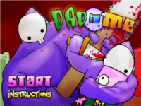
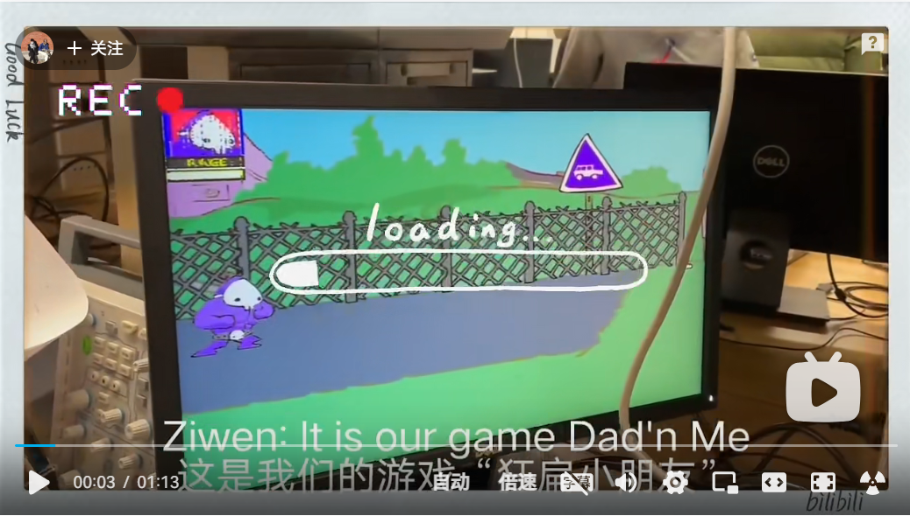



# ECE385 Fall 2021  

##  Final Project Report: Dad ’n Me

**©  [Fan Yang](https://github.com/fan19-hub) © [Chang Su](https://github.com/fan19-hub) © [Ziwen Wang](https://github.com/ziwenwang5)**
**Warning: The use of this program for Academic Plagiarism will be severely condemned. However, we encourage you to borrow ideas and use them in your final project**

## Video Demo

### 1. **Main Introduction**  

Dad ‘n Me is a fighting game from Newgrounds released in 2005. It was originally a game based on computer, and we plant the game into FPGA. We copy the photos from the original game and deal them with algorithms, which will be introduced behind detailedly, to reduce their size considering the memory limitation of FPGA. The algorithms allow us set more photos , in both quality and quantity, including the stickers and the backgrounds to make the game more vivid and interesting. And the logic of the game is totally coded by ourselves, we play the game then know how the game is constructed, and try to realized it by FPGA. 

When demoing, we manage to achieve mosts of functioanlities of the original game. We can control the character by W, A ,S, D to have it move upwards, leftwards, downwards and rightwards. The character is live with a “shaking body” rather than a sticked photo, and it will change direction depends on the direction of movement. There are two normal enemies moving randomly in the whole map with a blood bar having no ability to attack and a boss chasing our character based on the relative direction of it and our character with the ability to fight. Similar to the character, the normal enemies and boss are also live with shaking bodies. Besides, the map of the game is bigger than the screen so the picture will moving as the character moving. 

### 2. **Introduction to Playing Game**

Our game Dad 'n me requires a keyboard to operate. We just use the normal USB keyboard. We support up to two keys for simultaneous input, which is enough for this game. As a result of that, our main character could move diagonally. Keyboard input determines the states and movement of the main character. Here we use a module called key\_control to output the signal for other parts of the project. 

As an action game, I'd like to focus on our action aspect. Just like the ball module in lab8, W key means moving up; S key means moving down; A key means moving left; D key means moving right. And the main character will move only a little distance instead of moving constantly. When you press J key on the keyboard, key\_control module will output a signal attack, then the attack signal will enter the ISDU module, which is the main state machine module for the main character. Then ISDU module will output the state signal. It will enter the Me\_ROM module and control the animation of the main character. Then the main character will show strike animation. At the same time, the attack signal will also enter the enemy module along with the data about the position of the main character. If they are close, then the state machine in the enemy module will enter the BEIDA state. And the signal output from it will enter the En\_ROM module and then the normal enemy will show the being attacked animation. Besides, we could press the J key repeatedly and quickly, then the main character will perform combos (lianji in Chinese), which is very different from only one J input. This is achieved through the proper design of the state machine inside the ISDU module. Combos operation is very like the original game.

In addition, one of the highlights of our game is the colorful, expansive background that can move the camera as the main character moves. You can also switch between two large scenes. The detailed introduction to this part is in the part 5 of this report, namely the algorithm part. 

Besides, in our game, there will be one mini boss who is always chasing for the main character. And when it is very close to the main character, it will enter the DA state. Then it should display the attack animation and output a signal which will make the main character enter the BEIDA state. But the time is limited, and the memory is also limited, so the attack of the mini boss is deleted at last. In any case, its presence increases the psychological pressure on the player.

With the addition of the sound and the win screen and the fail screen, our game is very close to the original Dad ‘n me. 

### 3. **Top-level Block Diagram &RTL view**

### 4. **Achieved Difficulty and List of Features**

(1). Addition of sound

Just as what I wrote above, we add the sound to our game. The sound is just the original background music of the Dad ‘n me. And we store that in the Flash. Then we also build the Flash interface inside the top-level entity: lab8.sv. And the sound will just loop itself. 

(2). Score keeping in game

Every enemy in our game has its own blood bar. And every time the enemy loses its blood, the score in our game will increase. However, when we add this function to the project, the game interface is getting pretty sluggish. So we have to delete this at last. You can still find this in our code. 

(3). Multi-key input at the same time for USB keyboard

To achieve it, we add another PIO part called keycode\_2 in the platform designer which is the similar to the keycode. And I also change the C code to let it be the part two of the keyboard input. As a result of that, for example, if you press “w” and “a” key at the same time, the main character will move to the upper left.

(4). AI

The mini boss I mentioned in part 2 is really an AI. It will choose the moving direction and its speed according to the position relative to the main character. Every clock it will calculate the new speed and direction according to its specific algorithm. 

(5). Sprite

There are about 10 different kinds of sprites in our game. The theory of sprite is based on the state machine. At different state, the main character and the enemy will show different illustrations. Controlling the timing of state transitions, the sprite will show in the screen.

(6). Sophisticated graphics drawing

The original Dad ‘n me is created after 2007. And it’s created based on the flash. As a result of that, the image is not pixelated. Then it’s very hard for us to drawing sophisticated graphics especially for the background picture. Because of many different kinds of colors, the memory of the background picture is very big. And we use the palette to solve this problem. And we use SRAM to store the two big backgrounds. 

(7). Movable viewing angle

In our game, if you move the main character. If it’s not in the corner of the background, the viewing angle will move after it. We achieve it by the output signal roll from the ball.sv. Then it will enter the background.sv and it will make a judgement that whether the viewing angle should change.

(8). Use of multiple storage methods

Our audio is stored in the Flash. Our background picture is stored in SRAM. The illustrations for the sprite of our characters are stored in the ROM. 

(9). Short Compile time

With two big background pictures, victory picture and lose picture, and dozens of illustrations, our original compile time is about 20 minutes, which is inconvenient for debug and demo. And then we figure out some algorithm to manipulate pictures. And then finally our compile time is only 4 minutes.

(10). Complicated state machine

This has been shown in other sections especially for the sprite part. In part 6, it will be explained more detailed. 

(11). Combos (lianji in Chinese)

As an action game, if you only have one attack sprite then the hit feel of the game will be bad. Thus our goal is to achieve the combos operation when you press “J” key repeat in a short time. In the keycode module, we use many states for the output of the attack signal. Then in the ISDU module, we use about ten states for the transformation of the sprite. 

(12). Image mirror flipping algorithm

As a 2D horizontal version of action games, every character could face right and face left. Importing an image into memory after it is processed symmetrically consumes both time and memory. So we make out the image mirror flipping algorithm to process the data from .txt file to save both time and memory. 

### 5. **Image Core Algorithm**

(1). Image storage in ROM

Initially if we want to store an image in ROM, we need to use a ROM with width\*height addresses and 24 bits for each address. To reduce the usage of space, we apply the method “one specific palette for one figure”. Thus the palette can only hold few types of colors and we can limit the bit depth of the ROM within 8 or even 4. It significantly reduce the time for compiling.

(2).  Image mirror flipping algorithm

The character in our game can face right or left. Thus pairs of symmetrically processed image needed to be stored into memory, consuming both time and memory. Therefore, we design a mirror image flipping algorithm to flip the image. It will take the position of the character as the “center”, recording the width\_left and width\_right. It will first judge the range of the flipped image and then do a mapping of reflection.

3). Tiled and rolled background

The whole background is stored in the SRAM. We record the left side x coordinate of the screen and display the required range. By updating the Screen\_X\_Min, we can roll the background and let it follow the motion of the main character. 
**

### 6. **The State Machine**

Although there are multiple state machines in our project, here I just introduce 3 state machines and the connection between them. First one is the state machine in the key\_control module. When you press different key on the keyboard, the inner signals inside this module will change, and these signals will make the state change. And the output of each state will enter the ISDU module to control the transformation of the state machine in ISDU.sv. ISDU state machine is used to control the sprite of the main character through the output of each state. Besides, these states will also enter the enemy module. Inside enemy.sv, there is also one state machine, which controls not only the behavior of the enemy, but also controls the sprite of the normal enemy. The state transformation of the enemy module is controlled by the output of the ISDU state machine. In this way, all the three state machines are connected and one complicated total state machine is formed. 

### 7. **Written - Description of Each Module**

This project is redesigned based on the lab 8 so that many modules are from or similar to the lab 8. Due to the respect to the copyright, many modules are not even renamed. 

##### 1. Modules: LB\_ROM

- Inputs: Clk, read\_address

- Outputs: data\_Out

- Description: this module will read the memory of address at read\_address and save it into data\_out as the Clc running. 

- Purpose: this module will load information from read\_address to data\_Out.

  

##### 2. Modules: RGB\_SUCCESS

- Inputs: Clk, success, DrawX, DrawY

- Outputs: success\_rgb, show\_success

- Description: this module will draw the success interface when success signal is received as the Clk running. The success interface will be drawn base on singal DrawX, DrawY so that the drawwing zone can be at the exact center of the monitor region. 

  - Purpose: this module will draw success logo at the center of the monitor. 

##### 3. Modules: level\_state

- Inputs: next,frame\_clk,Reset, pass, ok

- Outputs: offset, level\_reset, success, fail, level

- Description: this module is a statemachine that will run a state loop as frame\_clk running to play the animation of interface. And some - inputs will change the - outputs. 

  - Purpose: this module will running the overall animation. 

##### 4. Modules: BGM

- Inputs: Clk, Reset, data\_over, FL\_DQ

- Outputs: Audio\_Data, FL\_OE\_N, FL\_RST\_N, FL\_WE\_N, FL\_CE\_N, FL\_ADDR

- Description: this module will read the information from data\_over to synthesize the Audio\_data that is readable for the microphone as the Clk running until receiving the Reset siginal. 

- Purpose: this module will generate the signal to play music. 

##### 5. Modules: blood\_bar 

- Inputs: Clk,frame\_clk, blood, DrawX, DrawY,

- Outputs: is\_blood\_bar, blood\_bar\_rgb\_index

- Description: this module will draw a blood bar with length from signal blood to given character as clk running. The DrawX, DrawY signals will make the drawwing zone at the top of the given character. 

  - Purpose: this module will draw a blood bar at the top of given character. 

##### 6. Modules: ISDU

- Inputs: frame\_clk,Clk,Reset,left,attack,thump, keycode,keycode\_2,

- Outputs: state, me\_state\_out, fly

- Description: this module is a state machine that will run a state loop to animate the character as the signal clk running. The state machine will go to brances as different signals are received. 

  - Purpose: : this module will running the animation of the character.

##### 7. Modules: key\_control

- Inputs: Clk, Reset, frame\_clk,  keycode,keycode\_2,

- Outputs: left,attack,thump,next,ok

- Description: this module will interpret the signal of keycode into the logic of game. Different keycodes have different functionalities that will be visualized by this module. 

  - Purpose: this module interpret the keycodes. 

##### 8. Modules: tristate

- Inputs: Clk, tristate\_output\_enable, Data\_write

- Outputs: Data\_read, Data

- Description: this module will interpret the data from Mem2IO, Data\_write back to the bus into the Mem2IO, Data\_read. 

  - Purpose: this module will interpret data circling the bus. 

##### 9. Modules: RGB\_driver

- Inputs: rgb\_index

- Outputs: rgb\_out

- Description: this module will interpret the 8-bit rgb\_index into a 24-bit rgb\_out to make the drawwing successfully as well as reduce the size of given pictures. And the transparent pixel will be especially marked. 

  - Purpose: intrerpretation the 8-bit RGB information. 

##### 10. Modules: Mem2IO

- Inputs: Clk, Reset, ADDR, WE, Data\_from\_CPU, Data\_from\_SRAM,

- Outputs: Data\_to\_CPU, Data\_to\_SRAM

- Description: this module will interpret the Data\_from\_CPU, Data\_from\_SRAM, with effects of Reset, ADDR, WE, into Data\_to\_CPU and Data\_to\_SRAM respectively. 

  - Purpose: intrerpretation the data from CPU and SRAM.

##### 11. Modules: Background

- Inputs: Clk, Reset,  frame\_clk, left,  roll,offset, DrawX, DrawY,

- Outputs: relative\_address, Screen\_X\_Min

- Description: this module will draw the backgrounds into the monitor as clk running. The offset, DrawX, DrawY will make the drawing region desired, relatively centerring the character. 

  - Purpose: drawwing the backgrounds. 

##### 12. Modules: Me\_ROM

- Inputs: state, relative\_address, Clk,frame\_clk, Reset,

- Outputs: data\_Out

- Description: this module will read the memory of address at relative\_address and save it into data\_out as the Clk running. 

  - Purpose: this module will load information from read\_address to data\_Out.

##### 13. Modules: hpi\_io\_intf

- Inputs: Clk, Reset, from\_sw\_address, from\_sw\_data\_out, from\_sw\_r, from\_sw\_w, from\_sw\_cs, from\_sw\_reset, OTG\_DATA,	

- Outputs: from\_sw\_data\_in, OTG\_ADDR, OTG\_RD\_N, OTG\_WR\_N, OTG\_CS\_N, OTG\_RST\_N

- Description: switch It’s the module that generates interface between NIOS II and EZ-OTG chip. Specially, OTG\_DATA should be high Z (tristated) when NIOS is not writing to OTG\_DATA inout bus.

  - Purpose: It’s used to generate interface between NIOS II and EZ-OTG chip.

##### 14. Modules: VGA\_controller

- Inputs: Clk,  Reset, VGA\_CLK

- Outputs: VGA\_HS, VGA\_VS, VGA\_BLANK\_N, VGA\_SYNC\_N, DrawX, DrawY

- Description: It divides the whole monitor to 800\*525 pixels. And signal is registered to ensure clean output waveform. 

- Purpose: It’s used to control the behavior of VGA.

Modules: lab8

- Inputs: CLOCK\_50, OTG\_INT, [3:0] KEY

- Outputs: HEX0, HEX1, [7:0] VGA\_R, VGA\_G, VGA\_B, VGA\_CLK, VGA\_SYNC\_N, VGA\_BLANK\_N, VGA\_VS, VGA\_HS, [1:0] OTG\_ADDR, OTG\_CS\_N, OTG\_RD\_N, OTG\_WR\_N, OTG\_RST\_N, [12:0] DRAM\_ADDR, [1:0] DRAM\_BA, [3:0] DRAM\_DQM, DRAM\_RAS\_N, DRAM\_CAS\_N, DRAM\_CKE, DRAM\_WE\_N, DRAM\_CS\_N, DRAM\_CLK

- Description: This is a top-level module for lab8 project that connects interface between NIOS II and EZ-OTG chip and other parts, including vga, ball and so on. 

- Purpose: This module is used to build interface between NIOS II and EZ-OTG chip. In it we build every part for lab8, includes vga, ball and also the HexDriver for keyboard. 

  

##### 15. Modules: HexDriver

- Inputs: In0

- Outputs: Out0

- Description: it’s a module that control what will be show on the led according to the input.

  - Purpose: it’s used to control what will be show on the led.

##### 16. Modules: color\_mapper

- Inputs:is\_ball,is\_enemy,is\_enemy3,is\_blood\_bar,is\_en\_blood\_bar,show\_success, show\_fail, DrawX, DrawY, success\_rgb, fail\_rgb, en\_rgb, me\_rgb, en\_rgb3,  bg\_rgb\_index, blood\_bar\_rgb\_index,

- Outputs: VGA\_R, VGA\_G, VGA\_B, color\_index

- Description: It’s a module that decides which color to be output to VGA for each pixel.

  - Purpose: This module is used to give color to each pixel.

##### 17. Modules: ball

- Inputs: Clk, Reset, frame\_clk, DrawX, DrawY, keycode,keycode\_2, Screen\_X\_Min, state, left,level,

- Outputs: is\_ball, roll, relative\_address, Ball\_X\_Pos,Ball\_Y\_Pos, me\_dead, r

- Description: this module is coded based on the movement of ball. It’s a module that controls the behavior of character, including the bounce, advance and the initial condition. 

  - Purpose: it’s used to control the character’s movement.

##### 18. Modules: En\_ROM

- Inputs: read\_address, Clk,beida,frame\_clk, enemy\_left, en\_move,

- Outputs: data\_Out

- Description: this module will read the memory of address at read\_address and save it into data\_out as the Clc running. 

  - Purpose: this module will load information from read\_address to data\_Out.

##### 19. Modules: enemy

- Inputs: Clk, Reset, frame\_clk, DrawX, DrawY, Screen\_X\_Min, S\_X\_Pos, S\_Y\_Pos, Ball\_X\_pos, Ball\_Y\_pos, attack, fly,left

- Outputs: is\_enemy,enemy\_left,beida,is\_en\_blood\_bar,en\_dead, relative\_address, en\_move, curr\_state1

- Description: this module is coded based on the movement of ball. It’s a module that controls the behavior of enemy, including the bounce, advance and the initial condition. 

  Purpose : it’s used to control the enemy’s movement.

##### 20. Modules: Little\_Boss

- Inputs: Clk, Reset, frame\_clk, DrawX, DrawY, Screen\_X\_Min, S\_X\_Pos, S\_Y\_Pos, Ball\_X\_pos, Ball\_Y\_pos, attack, fly,left

- Outputs: is\_enemy,enemy\_left,beida,is\_en\_blood\_bar,en\_dead, relative\_address, en\_move, curr\_state1

- Description: this module is coded based on the movement of ball. It’s a module that controls the behavior of boss, including the bounce, advance and the initial condition. 

  Purpose : it’s used to control the boss’s movement.

##### 21. **Platform Designer Modules**

  

PIO: keycode

- Inputs: clk, reset

- Outputs: [7:0] keycode\_export

- - Base Address: 0x0000\_0080

- Description: It’s the stored data for the key press. 

- Purpose: pass the data from the keyboard to FPGA board.

PIO: keycode\_2

  

- Inputs: clk, reset

- Outputs: [7:0] keycode\_2\_export

- Base Address: 0x0000\_0100

- Description: It’s the stored data for the second key press when you press two keys at the same time. 

- Purpose: pass the data from the keyboard to FPGA board.

PIO: otg\_hpi\_address

- Inputs: clk, reset

- Outputs: [1:0] otg\_hpi\_address\_export

- Base Address: 0x0000\_0090

- Description: It will output one signal to give address so that we know which register will be used. 

- Purpose: Output address signal so that we know which register will be used.

  

PIO: otg\_hpi\_data

- Inputs: clk, reset, [15:0] otg\_hpi\_data\_in\_port

- Outputs: [15:0] otg\_hpi\_data\_out\_port

- Base Address: 0x0000\_00a0

- Description: It will output data that will be stored in the hpi register.

- Purpose: it’s used to transfer data between NIOS II and USB chip. 

PIO: otg\_hpi\_r

- Inputs: clk, reset

- Outputs: otg\_hpi\_r\_export 

- Base Address: 0x0000\_00b0

- Description: It will output signal that controls whether to read data from hpi register or not.

- Purpose: it will be 1 when reading data from hpi register.

PIO: otg\_hpi\_w

- Inputs: clk, reset

- Outputs: otg\_hpi\_w\_export 

- Base Address: 0x0000\_00c0

- Description: It will output signal that controls whether to write data to hpi register or not.

- Purpose: it will be 1 when writing data to hpi register.

PIO: otg\_hpi\_cs

  

- Inputs: clk, reset

- Outputs: otg\_hpi\_cs\_export

- Base Address: 0x0000\_00d0

- Description: It will output signal that controls whether to do IOWrite or IORead.

- Purpose: it will be 0 when needing to do IOWrite or IORead.

PIO: otg\_hpi\_reset

  

- Inputs: clk, reset

- Outputs: reset\_reset\_n

- Base Address: 0x0000\_00e0

- Description: It will output signal that controls whether to reset or not.

- Purpose: it will be 1 when doing reset.

### 8. **Design Resources**

|LUT|13629|
| :-: | :-: |
|DSP|70|
|Memory (BRAM)|820224|
|Flip-Flop|2644|
|Frequency|119.25MHz|
|Static Power|214.83mW|
|Dynamic Power|0.75mW|
|Total Power|106.14mW|

### 9. **Conclusion**

The game is the largest achievement that we explore in our academic career. It makes us know the complexity of a even very looks simple game if it’s FPGA based. Besides, it makes us appreciate the splendid achievement and the fast development speed of TTL Chips and computers. Using the codes based on the bottom structures we also understand the computer better. 

The complexity of the design also force us to split work into small pieces and force us to understand what others are doing, which strengthens our ability of coworking, commutation. Due to the overwhelming dues in the final weeks, we have to assign time well to deal with all the jobs. Our management also builds our confidence of facing hard work. 

